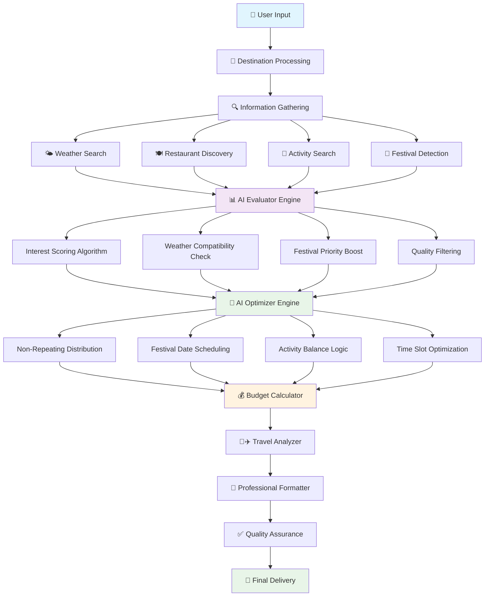

# 🌟 Smart Trip Scout AI

A comprehensive AI-powered travel planning application that creates personalized trip itineraries using OpenAI's advanced language models. Smart Trip Scout provides intelligent recommendations based on your interests, weather conditions, budget preferences, and travel constraints with professional-grade formatting and real-time updates.

## ✨ Features

### 🤖 **Core AI Planning**
- **Advanced AI Planning**: Uses OpenAI's GPT models with sophisticated function tools for intelligent trip optimization
- **Interest-Based Matching**: Tailors recommendations based on your specific interests and preferences
- **Weather Integration**: Considers weather conditions when recommending indoor vs outdoor activities
- **Confidence Scoring**: Provides transparency with AI confidence levels for each recommendation

### 🎪 **Event & Activity Discovery**
- **Festival & Event Detection**: Automatically discovers local festivals and special events during your trip dates (40% probability simulation)
- **Non-Repeating Activities**: Smart distribution of activities across days to avoid repetition
- **Activity Optimization**: Prioritizes time-sensitive events like festivals on specific dates
- **Interest Scoring**: Advanced scoring system that matches activities to your preferences

### 💰 **Budget & Cost Management**
- **Multi-Tier Budget Planning**: Low, mid, and luxury budget options with detailed cost breakdowns
- **Regional Pricing**: Adjusts costs based on destination's cost of living (35+ destinations supported)
- **Multi-Traveler Support**: Accurate cost calculations for groups of 1-20 travelers
- **Lodging Options**: Include or exclude accommodation costs in your budget
- **Cost Categories**: Detailed breakdown of meals, activities, transport, lodging, and miscellaneous expenses

### 🚗✈️ **Travel Cost Comparison**
- **Driving vs Flying Analysis**: Comprehensive comparison of travel options from your origin city
- **Real Cost Calculations**: Includes gas, tolls, wear-and-tear for driving; flight costs for flying
- **Time Analysis**: Compares total travel time including airport procedures
- **Smart Recommendations**: AI-powered suggestions based on cost, time, and group size
- **Route Planning**: Distance and duration calculations for driving routes

### 📧 **Professional Communication**
- **Beautiful Email Formatting**: Professional HTML emails with structured layouts, gradients, and visual elements
- **Push Notifications**: Instant notifications via Pushover when your plan is ready
- **Responsive Design**: Emails look great on desktop and mobile devices with modern styling
- **Rich Content**: Includes trip overview cards, detailed itineraries, cost breakdowns, and travel comparisons

### 🖥️ **User Experience**
- **Modern Web Interface**: Built with Gradio for an intuitive, responsive experience
- **Real-Time Updates**: Live progress updates during trip planning with emoji indicators
- **Multi-Port Support**: Automatic port selection (7860-7864) if default ports are busy
- **Error Handling**: Comprehensive error handling with user-friendly messages
- **Professional Output**: Clean, formatted trip plans with visual hierarchy and organization

## 🚀 Quick Start

1. **Clone the repository**
   ```bash
   git clone https://github.com/reedba/Smart-Trip-Scout-AI-OpenAI-sdk.git
   cd Smart-Trip-Scout-AI-OpenAI-sdk
   ```

2. **Install dependencies**
   ```bash
   pip install -r requirements.txt
   ```

3. **Set up environment variables**
   ```bash
   cp .env.example .env
   ```
   
   Edit `.env` and add your API keys:
   ```
   OPENAI_API_KEY=your_openai_api_key_here
   SENDGRID_API_KEY=your_sendgrid_api_key_here  # Optional: for email
   PUSHOVER_USER_KEY=your_pushover_user_key_here  # Optional: for push notifications
   PUSHOVER_API_TOKEN=your_pushover_api_token_here  # Optional: for push notifications
   ```

4. **Run the application**
   ```bash
   python trip_scout.py
   ```

5. **Open your browser**
   - The app will start on `http://localhost:7860` (or next available port)
   - A shareable link will also be provided

## 🎯 How It Works

The Smart Trip Scout follows these AI-powered stages with real-time updates:

### 🔄 AI Workflow Architecture



### 🔧 Detailed AI Processing Pipeline

```
┌─────────────────────────────────────────────────────────────────────┐
│                    🤖 SMART TRIP SCOUT AI ENGINE                    │
└─────────────────────────────────────────────────────────────────────┘

📥 INPUT PROCESSING
┌─────────────────────────────────────────────────────────────────────┐
│ User Inputs → Validation → Interest Parsing → Date Processing       │
│ destination, dates, interests, budget, travelers, origin            │
└─────────────────────────────────────────────────────────────────────┘
                                    ↓
🔍 INFORMATION GATHERING STAGE
┌─────────────────────────────────────────────────────────────────────┐
│ ┌─────────────┐ ┌─────────────┐ ┌─────────────┐ ┌─────────────┐    │
│ │   Weather   │ │ Restaurants │ │ Activities  │ │  Festivals  │    │
│ │   Search    │ │  Discovery  │ │   Search    │ │  Detection  │    │
│ │    Tool     │ │    Tool     │ │    Tool     │ │    Tool     │    │
│ └─────────────┘ └─────────────┘ └─────────────┘ └─────────────┘    │
└─────────────────────────────────────────────────────────────────────┘
                                    ↓
📊 AI EVALUATOR ENGINE
┌─────────────────────────────────────────────────────────────────────┐
│                        function_tool_evaluator()                    │
│                                                                     │
│  🎯 Interest Matching Algorithm:                                    │
│  ┌─────────────────────────────────────────────────────────────┐   │
│  │  for each item:                                             │   │
│  │    base_score = 0.5                                         │   │
│  │    for interest in user_interests:                          │   │
│  │      if interest matches item_tags:                         │   │
│  │        interest_bonus += 0.2                                │   │
│  │    if weather_compatible:                                   │   │
│  │      weather_bonus = 0.1                                    │   │
│  │    final_score = min(1.0, base + interest + weather)       │   │
│  └─────────────────────────────────────────────────────────────┘   │
│                                                                     │
│  🎪 Festival Priority Boost:                                       │
│  ┌─────────────────────────────────────────────────────────────┐   │
│  │  if item.type in festival_types:                            │   │
│  │    item.score += 0.2  # Special time-sensitive boost       │   │
│  └─────────────────────────────────────────────────────────────┘   │
│                                                                     │
│  📈 Output: Scored & Ranked Lists                                  │
│  ┌─────────────────────────────────────────────────────────────┐   │
│  │  scored_restaurants = [item1: 0.8, item2: 0.7, ...]       │   │
│  │  scored_activities = [item1: 0.9, item2: 0.6, ...]        │   │
│  │  scored_festivals = [item1: 0.9, item2: 0.8, ...]         │   │
│  └─────────────────────────────────────────────────────────────┘   │
└─────────────────────────────────────────────────────────────────────┘
                                    ↓
🧠 AI OPTIMIZER ENGINE
┌─────────────────────────────────────────────────────────────────────┐
│                       function_tool_optimizer()                     │
│                                                                     │
│  🔄 Non-Repeating Distribution Logic:                               │
│  ┌─────────────────────────────────────────────────────────────┐   │
│  │  used_activities = set()                                    │   │
│  │  used_restaurants = set()                                   │   │
│  │  for each_day:                                              │   │
│  │    available = [item for item in items                     │   │
│  │                 if item.name not in used_activities]       │   │
│  │    if not available:  # Reset pool if exhausted            │   │
│  │      used_activities.clear()                               │   │
│  │      shuffle(available_activities)                         │   │
│  └─────────────────────────────────────────────────────────────┘   │
│                                                                     │
│  🎪 Festival Date-Specific Scheduling:                             │
│  ┌─────────────────────────────────────────────────────────────┐   │
│  │  festivals_today = [festival for festival in festivals     │   │
│  │                     if festival.start_date <= current_date  │   │
│  │                     <= festival.end_date]                   │   │
│  │  if festivals_today:                                        │   │
│  │    prioritize_festival_for_morning_activity()               │   │
│  └─────────────────────────────────────────────────────────────┘   │
│                                                                     │
│  ⚖️ Activity Balance & Time Management:                             │
│  ┌─────────────────────────────────────────────────────────────┐   │
│  │  Morning: Prefer outdoor if weather good, festivals        │   │
│  │  Afternoon: Mix of indoor/outdoor, cultural experiences    │   │
│  │  Evening: Restaurants, entertainment, relaxation           │   │
│  │  Ensure variety: culture/nature/food/entertainment mix     │   │
│  └─────────────────────────────────────────────────────────────┘   │
│                                                                     │
│  📅 Output: Optimized Daily Itinerary                              │
│  ┌─────────────────────────────────────────────────────────────┐   │
│  │  itinerary = {                                              │   │
│  │    "2025-08-15": {                                          │   │
│  │      "morning": festival_or_activity,                      │   │
│  │      "afternoon": complementary_activity,                  │   │
│  │      "evening": restaurant                                 │   │
│  │    }, ...                                                   │   │
│  │  }                                                          │   │
│  └─────────────────────────────────────────────────────────────┘   │
└─────────────────────────────────────────────────────────────────────┘
                                    ↓
💰 BUDGET & COST ANALYSIS
┌─────────────────────────────────────────────────────────────────────┐
│  Regional Pricing → Multi-Tier Budgets → Group Calculations         │
│  Travel Comparison → Cost Breakdowns → Recommendations              │
└─────────────────────────────────────────────────────────────────────┘
                                    ↓
📧 PROFESSIONAL FORMATTING & DELIVERY
┌─────────────────────────────────────────────────────────────────────┐
│  Beautiful Formatting → Email Generation → Quality Check → Delivery │
└─────────────────────────────────────────────────────────────────────┘
```

### Stage 1: Information Gathering 🔍
- **Weather Search**: Current conditions and forecasts for your destination
- **Restaurant Discovery**: Finds dining options based on your interests and budget level
- **Activity Search**: Discovers attractions, tours, and experiences
- **Festival Detection**: Searches for special events and festivals during your trip dates

### Stage 2: Intelligent Evaluation 📊
- **Interest Scoring**: Advanced algorithm scores each option based on your preferences
- **Weather Compatibility**: Adjusts recommendations based on weather conditions
- **Festival Prioritization**: Boosts scores for time-sensitive events
- **Quality Filtering**: Ensures only high-quality recommendations make it to your itinerary

### Stage 3: Smart Optimization 🗓️
- **Non-Repeating Distribution**: Ensures variety across all days of your trip
- **Festival Integration**: Automatically schedules festivals on appropriate dates
- **Activity Balancing**: Mixes indoor/outdoor, cultural/entertainment, active/relaxing
- **Time Management**: Optimizes morning, afternoon, and evening activities

### Stage 4: Budget Calculation 💰
- **Multi-Tier Pricing**: Calculates costs for low, mid, and luxury budget levels
- **Regional Adjustments**: Applies cost-of-living multipliers for accurate pricing
- **Group Calculations**: Scales costs appropriately for multiple travelers
- **Category Breakdown**: Detailed analysis of meals, activities, transport, and lodging

### Stage 5: Travel Analysis 🚗✈️ (If Origin Provided)
- **Distance Calculation**: Real driving distances and flight durations
- **Cost Comparison**: Comprehensive cost analysis for both options
- **Time Analysis**: Total travel time including driving fatigue and airport procedures
- **Smart Recommendations**: AI-powered suggestions based on your specific situation

### Stage 6: Quality Assurance ✅
- **Confidence Assessment**: Evaluates the overall quality of recommendations
- **Feedback Integration**: Suggests areas for user review if confidence is low
- **Final Optimization**: Last-minute improvements and refinements

### Stage 7: Professional Delivery 📧
- **Formatted Output**: Clean, professional trip plans with visual hierarchy
- **Email Delivery**: Beautiful HTML emails with structured layouts and rich content
- **Push Notifications**: Instant alerts when your plan is ready

## 📝 Example Usage

### Basic Trip Planning
**Input:**
- **Destination**: Tokyo, Japan
- **Origin City**: Los Angeles, CA
- **Dates**: 2025-08-15 to 2025-08-20
- **Travelers**: 2 people
- **Budget**: Mid-range
- **Interests**: food, culture, technology, anime
- **Include Lodging**: Yes

**Output:**
```
╔══════════════════════════════════════════════════════════════╗
║                    🌟 SMART TRIP SCOUT PLAN                  ║
║                         Tokyo, Japan                         ║
╚══════════════════════════════════════════════════════════════╝

📋 TRIP OVERVIEW
━━━━━━━━━━━━━━━━━━━━━━━━━━━━━━━━━━━━━━━━━━━━━━━━━━━━━━━━━━━━━━━━━━━
📅 Travel Dates:    2025-08-15 → 2025-08-20 (6 days)
👥 Travelers:       2 persons
💰 Budget Tier:     Mid Level
🎯 Interests:       Food, Culture, Technology, Anime
📊 Confidence:      🟢 High (85%)

🌤️  WEATHER FORECAST
━━━━━━━━━━━━━━━━━━━━━━━━━━━━━━━━━━━━━━━━━━━━━━━━━━━━━━━━━━━━━━━━━━━
🌡️  Temperature:    28°C
☀️  Conditions:     Partly Cloudy
🌈  Forecast:       Warm with occasional rain showers

🗓️  DAILY ITINERARY
━━━━━━━━━━━━━━━━━━━━━━━━━━━━━━━━━━━━━━━━━━━━━━━━━━━━━━━━━━━━━━━━━━━

📍 Thursday, August 15, 2025
─────────────────────────────────────────────────────────────
🌅 MORNING     │ Tokyo Anime Center
              │ Cultural • ⭐⭐⭐⭐☆ (4.2/5)
☀️  AFTERNOON  │ Tech Museum Interactive Tour
              │ Technology • ⭐⭐⭐⭐⭐ (4.7/5)
🌙 EVENING     │ Traditional Ramen House
              │ Japanese Cuisine • ⭐⭐⭐⭐☆ (4.4/5)
```

### Advanced Features in Action

**Festival Detection:**
- Automatically discovers "Tokyo Summer Festival" during your dates
- Prioritizes festival scheduling on specific days
- Integrates cultural events with your interests

**Travel Cost Comparison:**
- Driving: $450 total (11 hours) - Not recommended for international travel
- Flying: $1,200 total (14 hours with connections) - **Recommended**

**Budget Breakdown (Mid-level for 2 travelers):**
- 🍽️ Meals & Dining: $600 (25% of budget)
- 🎯 Activities: $480 (20% of budget)
- 🚗 Local Transport: $240 (10% of budget)
- 🏨 Accommodation: $900 (37.5% of budget)
- 💼 Miscellaneous: $180 (7.5% of budget)
- **Total: $2,400 ($1,200 per person)**

## 🔧 File Structure

```
Smart-Trip-Scout-AI-OpenAI-sdk/
├── README.md                 # This comprehensive guide
├── requirements.txt          # Python dependencies
├── .env.example             # Environment variables template
├── trip_scout.py            # Main entry point
├── app.py                   # Enhanced Gradio web interface
└── planner.py              # Core AI planning logic with all features
```

## 🛠️ API Keys Setup

### Required:
- **OpenAI API Key**: Get from [OpenAI Platform](https://platform.openai.com/api-keys)
  - Used for: AI-powered trip planning and optimization
  - Cost: ~$0.01-0.10 per trip plan

### Optional (Highly Recommended):
- **SendGrid API Key**: Get from [SendGrid](https://sendgrid.com/)
  - Used for: Professional HTML email delivery
  - Cost: Free tier available (100 emails/day)

- **Pushover Credentials**: Get from [Pushover](https://pushover.net/)
  - Used for: Instant push notifications
  - Cost: One-time $5 fee per platform

## 🌍 Supported Destinations

The app includes regional pricing data for 35+ destinations:

**High-Cost Destinations**: Paris, London, New York, Tokyo, Sydney, Zurich  
**Medium-Cost Destinations**: Rome, Madrid, Berlin, Amsterdam, Barcelona  
**Lower-Cost Destinations**: Bangkok, Mexico City, Istanbul, Delhi, Lima

*Regional pricing automatically adjusts based on destination cost of living.*

## 💡 Advanced Usage Tips

### 1. **Optimal Planning**
- Use specific interests: "Italian food, Renaissance art, wine tasting"
- Include origin city for travel cost comparison
- Enable lodging costs for complete budget picture

### 2. **Festival Discovery**
- Plan trips during festival seasons for unique experiences
- App automatically detects and prioritizes time-sensitive events
- 40% chance simulation ensures realistic festival availability

### 3. **Budget Optimization**
- Low: Budget-friendly options, street food, public transport
- Mid: Balanced mix of experiences and comfort
- Luxury: Premium experiences, fine dining, private transport

### 4. **Group Planning**
- Cost calculations automatically scale for group size
- Driving becomes more cost-effective with larger groups
- Group discounts considered in activity pricing

### 5. **Email & Notifications**
- Professional HTML emails with rich formatting
- Save emails for offline reference during travel
- Push notifications provide instant plan completion alerts

## 🔒 Privacy & Security

- ✅ API keys stored locally in `.env` file
- ✅ No user data permanently stored or transmitted
- ✅ All communications use secure HTTPS APIs
- ✅ OpenAI data processing follows their privacy policy
- ✅ Email delivery through encrypted SendGrid channels

## 🛣️ Future Roadmap

### Phase 1: Real API Integration
- Google Maps API for real places and directions
- Google Flights API for actual flight pricing
- OpenWeatherMap for accurate weather forecasts

### Phase 2: Enhanced Features
- Real-time booking integration
- Interactive maps in email plans
- Social sharing capabilities
- Multi-language support

### Phase 3: Advanced AI
- Machine learning for preference learning
- Seasonal optimization algorithms
- Real-time price monitoring
- Dynamic itinerary adjustments

## 🤝 Contributing

We welcome contributions! Here's how to get started:

1. **Fork the repository**
2. **Create a feature branch**
   ```bash
   git checkout -b feature/amazing-feature
   ```
3. **Make your changes**
   - Add new features or improve existing ones
   - Update tests and documentation
   - Follow existing code style
4. **Test thoroughly**
   - Test with different destinations and parameters
   - Verify email formatting works correctly
   - Check budget calculations
5. **Submit a Pull Request**
   ```bash
   git commit -m 'Add amazing feature'
   git push origin feature/amazing-feature
   ```

### Contribution Ideas
- Add new regional pricing data
- Enhance festival detection algorithms
- Improve email template designs
- Add new budget calculation categories
- Integrate additional APIs

## 🐛 Troubleshooting

### Common Issues

**Port Already in Use**
```
Solution: App automatically tries ports 7860-7864
Manual: python trip_scout.py --port 7865
```

**Email Not Sending**
```
Check: SENDGRID_API_KEY in .env file
Verify: SendGrid account is active
Test: Try with a different email address
```

**Low Confidence Scores**
```
Cause: Vague interests or unusual destinations
Solution: Be more specific with interests
Example: "Italian Renaissance art" vs "art"
```

**API Rate Limits**
```
OpenAI: Upgrade to paid tier for higher limits
Solution: Add delays between requests if needed
```

### Getting Help

1. **Check Issues**: [GitHub Issues](https://github.com/reedba/Smart-Trip-Scout-AI-OpenAI-sdk/issues)
2. **Create New Issue**: Include error messages and steps to reproduce
3. **Discussion**: Use GitHub Discussions for questions and ideas

## 📄 License

This project is licensed under the MIT License - see the [LICENSE](LICENSE) file for details.

## 🙏 Acknowledgments

- **OpenAI** for providing advanced language models
- **Gradio** for the excellent web interface framework
- **SendGrid** for reliable email delivery services
- **Pushover** for push notification capabilities

---

**Ready to plan your next adventure? 🌍✈️**

*Smart Trip Scout AI - Where artificial intelligence meets wanderlust!*
