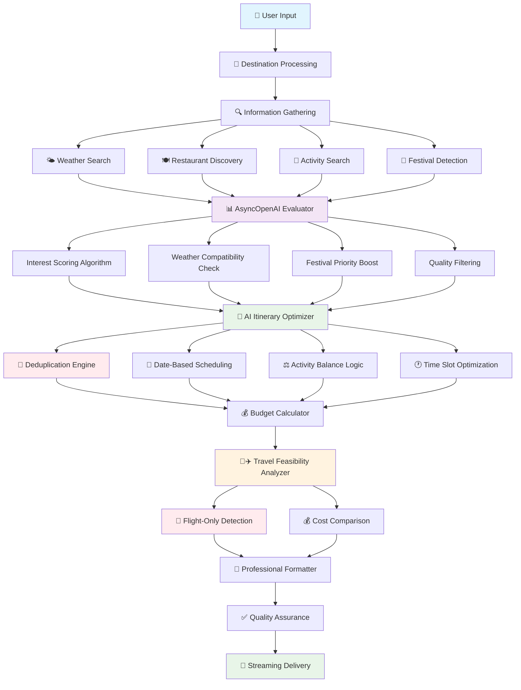

# 🌟 Smart Trip Scout AI

A comprehensive AI-powered travel planning application that creates personalized trip itineraries using OpenAI's latest AsyncOpenAI SDK. Smart Trip Scout provides intelligent recommendations based on your interests, weather conditions, budget preferences, and travel constraints with professional-grade formatting and real-time streaming updates.

## ✨ Features

### 🤖 **Core AI Planning**
- **Latest OpenAI AsyncOpenAI SDK**: Uses cutting-edge async OpenAI client with GPT-4 for intelligent trip optimization
- **Real-Time Streaming Updates**: Live progress updates during planning with emoji indicators showing exactly where you are in the process
- **Interest-Based Matching**: Tailors recommendations based on your specific interests and preferences
- **Weather Integration**: Considers weather conditions when recommending indoor vs outdoor activities
- **Confidence Scoring**: Provides transparency with AI confidence levels for each recommendation

### 🎪 **Event & Activity Discovery**
- **Festival & Event Detection**: Automatically discovers local festivals and special events during your trip dates
- **Zero-Duplicate Activities**: Advanced deduplication system ensures no repeated activities across your entire trip
- **Activity Optimization**: Prioritizes time-sensitive events like festivals on specific dates
- **Interest Scoring**: Advanced scoring system that matches activities to your preferences
- **Smart Activity Distribution**: Intelligently spreads unique activities across all days of your trip

### 💰 **Budget & Cost Management**
- **Multi-Tier Budget Planning**: Low, mid, and luxury budget options with detailed cost breakdowns
- **Regional Pricing**: Adjusts costs based on destination's cost of living (35+ destinations supported)
- **Multi-Traveler Support**: Accurate cost calculations for groups of 1-20 travelers
- **Lodging Options**: Include or exclude accommodation costs in your budget
- **Cost Categories**: Detailed breakdown of meals, activities, transport, lodging, and miscellaneous expenses

### 🚗✈️ **Intelligent Travel Analysis**
- **Flight-Only Destination Detection**: Automatically identifies destinations that require air travel (islands, overseas locations)
- **Smart Travel Restrictions**: Properly handles destinations like Hawaii, Caribbean islands, International locations
- **Driving vs Flying Analysis**: Comprehensive comparison when both options are available
- **Real Cost Calculations**: Includes gas, tolls, wear-and-tear for driving; flight costs for flying
- **Time Analysis**: Compares total travel time including airport procedures
- **AI-Powered Recommendations**: Smart suggestions based on cost, time, group size, and feasibility

### 📧 **Professional Communication**
- **Beautiful Email Formatting**: Professional HTML emails with structured layouts, gradients, and visual elements
- **Push Notifications**: Instant notifications via Pushover when your plan is ready
- **Responsive Design**: Emails look great on desktop and mobile devices with modern styling
- **Rich Content**: Includes trip overview cards, detailed itineraries, cost breakdowns, and travel comparisons

### 🖥️ **User Experience**
- **Modern Web Interface**: Built with Gradio for an intuitive, responsive experience
- **Real-Time Streaming**: Live progress updates during trip planning with detailed status messages
- **Multi-Port Support**: Automatic port selection (7860-7864) if default ports are busy
- **Error Handling**: Comprehensive error handling with user-friendly messages
- **Professional Output**: Clean, formatted trip plans with visual hierarchy and organization

## 🚀 Quick Start

1. **Clone the repository**
   ```bash
   git clone https://github.com/reedba/Smart-Trip-Scout-AI-OpenAI-sdk.git
   cd Smart-Trip-Scout-AI-OpenAI-sdk
   ```

2. **Install dependencies**
   ```bash
   pip install -r requirements.txt
   ```

3. **Set up environment variables**
   ```bash
   cp .env.example .env
   ```
   
   Edit `.env` and add your API keys:
   ```
   OPENAI_API_KEY=your_openai_api_key_here
   SENDGRID_API_KEY=your_sendgrid_api_key_here  # Optional: for email
   PUSHOVER_USER_KEY=your_pushover_user_key_here  # Optional: for push notifications
   PUSHOVER_API_TOKEN=your_pushover_api_token_here  # Optional: for push notifications
   ```

4. **Run the application**
   ```bash
   python trip_scout.py
   ```

5. **Open your browser**
   - The app will start on `http://localhost:7860` (or next available port)
   - A shareable link will also be provided

## 🎯 How It Works

The Smart Trip Scout follows these AI-powered stages with real-time updates:

### 🔄 Enhanced AI Workflow Architecture



### 🔧 Enhanced AI Processing Pipeline

```
┌─────────────────────────────────────────────────────────────────────┐
│                🤖 SMART TRIP SCOUT AI ENGINE v2.0                   │
│                    (Latest AsyncOpenAI SDK)                         │
└─────────────────────────────────────────────────────────────────────┘

📥 INPUT PROCESSING & VALIDATION
┌─────────────────────────────────────────────────────────────────────┐
│ User Inputs → Validation → Interest Parsing → Date Processing       │
│ destination, dates, interests, budget, travelers, origin            │
│ ✅ Real-time validation with streaming feedback                     │
└─────────────────────────────────────────────────────────────────────┘
                                    ↓
🔍 ENHANCED INFORMATION GATHERING
┌─────────────────────────────────────────────────────────────────────┐
│ ┌─────────────┐ ┌─────────────┐ ┌─────────────┐ ┌─────────────┐    │
│ │   Weather   │ │ Restaurants │ │ Activities  │ │  Festivals  │    │
│ │   Search    │ │  Discovery  │ │   Search    │ │  Detection  │    │
│ │    🌤️      │ │     🍽️      │ │     🎯      │ │     🎪     │    │
│ └─────────────┘ ┌─────────────┐ └─────────────┘ └─────────────┘    │
│ ⚡ Streaming Progress Updates: "🤖 AI analyzing destination..."     │
└─────────────────────────────────────────────────────────────────────┘
                                    ↓
📊 ASYNCOPENAI EVALUATOR ENGINE
┌─────────────────────────────────────────────────────────────────────┐
│                    AsyncOpenAI GPT-4 Evaluation                     │
│                                                                     │
│  🎯 Enhanced Interest Matching:                                     │
│  ┌─────────────────────────────────────────────────────────────┐   │
│  │  for each item in [activities, restaurants, festivals]:    │   │
│  │    base_score = 0.5                                        │   │
│  │    for interest in user_interests:                         │   │
│  │      if interest in item.tags:                             │   │
│  │        interest_bonus += 0.2                               │   │
│  │    if weather_compatible(item, weather_data):              │   │
│  │      weather_bonus = 0.1                                   │   │
│  │    if item.type == "festival":                             │   │
│  │      time_sensitive_boost = 0.2                            │   │
│  │    final_score = min(1.0, base + bonuses)                 │   │
│  └─────────────────────────────────────────────────────────────┘   │
│                                                                     │
│  📈 Output: Scored & Ranked Collections                            │
│  ┌─────────────────────────────────────────────────────────────┐   │
│  │  scored_restaurants = [item1: 0.9, item2: 0.8, ...]       │   │
│  │  scored_activities = [item1: 0.95, item2: 0.85, ...]      │   │
│  │  scored_festivals = [item1: 1.0, item2: 0.9, ...]         │   │
│  └─────────────────────────────────────────────────────────────┘   │
│                                                                     │
│  ⚡ Streaming: "🧠 AI evaluating activities based on preferences..." │
└─────────────────────────────────────────────────────────────────────┘
                                    ↓
🧠 AI ITINERARY OPTIMIZER WITH DEDUPLICATION
┌─────────────────────────────────────────────────────────────────────┐
│                      AsyncOpenAI GPT-4 Optimizer                    │
│                                                                     │
│  🚫 ZERO-DUPLICATE DISTRIBUTION ENGINE:                            │
│  ┌─────────────────────────────────────────────────────────────┐   │
│  │  used_activities = set()                                    │   │
│  │  used_restaurants = set()                                   │   │
│  │                                                             │   │
│  │  for day_num in range(trip_days):                          │   │
│  │    # Find unique activities for this day                   │   │
│  │    day_activities = []                                      │   │
│  │    for activity in scored_activities:                      │   │
│  │      activity_id = f"{activity.name}_{activity.type}"      │   │
│  │      if activity_id not in used_activities:                │   │
│  │        day_activities.append(activity)                     │   │
│  │        used_activities.add(activity_id)                    │   │
│  │        if len(day_activities) >= 3: break                  │   │
│  │                                                             │   │
│  │    # Same deduplication for restaurants                    │   │
│  │    # Only mark as "Return Visit" if truly no alternatives  │   │
│  └─────────────────────────────────────────────────────────────┘   │
│                                                                     │
│  📅 INTELLIGENT DATE-BASED SCHEDULING:                             │
│  ┌─────────────────────────────────────────────────────────────┐   │
│  │  for each_day in trip_duration:                            │   │
│  │    current_date = start_date + timedelta(days=day_num)     │   │
│  │    festivals_today = filter_festivals_by_date(current_date)│   │
│  │    if festivals_today:                                      │   │
│  │      prioritize_festival_for_morning_slot()                │   │
│  │    assign_time_slots(morning, afternoon, evening)          │   │
│  └─────────────────────────────────────────────────────────────┘   │
│                                                                     │
│  📅 Output: Optimized Multi-Day Itinerary                          │
│  ┌─────────────────────────────────────────────────────────────┐   │
│  │  itinerary = {                                              │   │
│  │    "2026-06-07": {                                          │   │
│  │      "morning": "Snorkeling at Coki Beach",               │   │
│  │      "lunch": "Beachside Grill",                          │   │
│  │      "afternoon": "Beach Fishing",                        │   │
│  │      "evening": "Magens Bay Beach Bar"                    │   │
│  │    },                                                       │   │
│  │    "2026-06-08": {                                          │   │
│  │      "morning": "Deep Sea Fishing Charter", # NEW         │   │
│  │      "lunch": "Coral World Snack Bar",      # NEW         │   │
│  │      "afternoon": "Sunset Sailing",         # NEW         │   │
│  │      "evening": "Fishing Village Restaurant" # NEW        │   │
│  │    }, ...                                                   │   │
│  │  }                                                          │   │
│  └─────────────────────────────────────────────────────────────┘   │
│                                                                     │
│  ⚡ Streaming: "📅 Planning Monday, June 08 (Day 2/7)..."          │
└─────────────────────────────────────────────────────────────────────┘
                                    ↓
🚗✈️ ENHANCED TRAVEL FEASIBILITY ANALYZER
┌─────────────────────────────────────────────────────────────────────┐
│                    Smart Travel Restriction Engine                  │
│                                                                     │
│  🚫 FLIGHT-ONLY DESTINATION DETECTION:                             │
│  ┌─────────────────────────────────────────────────────────────┐   │
│  │  flight_only_destinations = {                               │   │
│  │    "hawaii", "st thomas", "puerto rico", "alaska",         │   │
│  │    "caribbean", "bermuda", "virgin islands",               │   │
│  │    "uk", "france", "japan", "australia", ...              │   │
│  │  }                                                          │   │
│  │                                                             │   │
│  │  if any(place in destination.lower()                       │   │
│  │         for place in flight_only_destinations):            │   │
│  │    return {                                                 │   │
│  │      "driving": {"available": False,                       │   │
│  │                 "reason": "Island/Overseas destination"},  │   │
│  │      "flying": {"available": True, ...}                    │   │
│  │    }                                                        │   │
│  └─────────────────────────────────────────────────────────────┘   │
│                                                                     │
│  💰 COMPREHENSIVE COST COMPARISON (when both available):           │
│  ┌─────────────────────────────────────────────────────────────┐   │
│  │  driving_cost = calculate_gas_tolls_wear_tear()             │   │
│  │  flying_cost = calculate_flights_airport_transport()       │   │
│  │  time_comparison = driving_hours vs flight_plus_airport    │   │
│  │  recommendation = smart_decision(cost, time, group_size)   │   │
│  └─────────────────────────────────────────────────────────────┘   │
│                                                                     │
│  ⚡ Streaming: "🚫 Driving not possible - Island destination"       │
│  ⚡ Streaming: "✈️ Flying required - analysis complete!"            │
└─────────────────────────────────────────────────────────────────────┘
                                    ↓
💰 BUDGET & COST ANALYSIS
┌─────────────────────────────────────────────────────────────────────┐
│  Regional Pricing → Multi-Tier Budgets → Group Calculations         │
│  Travel Costs → Activity Costs → Restaurant Costs → Total Breakdown │
└─────────────────────────────────────────────────────────────────────┘
                                    ↓
📧 PROFESSIONAL FORMATTING & STREAMING DELIVERY
┌─────────────────────────────────────────────────────────────────────┐
│  Beautiful Formatting → Real-time Streaming → Email → Quality Check │
│  ⚡ User sees: "🎉 AI-powered trip planning complete!"              │
└─────────────────────────────────────────────────────────────────────┘
```
│ │   Search    │ │  Discovery  │ │   Search    │ │  Detection  │    │
│ │    Tool     │ │    Tool     │ │    Tool     │ │    Tool     │    │
│ └─────────────┘ └─────────────┘ └─────────────┘ └─────────────┘    │
└─────────────────────────────────────────────────────────────────────┘
                                    ↓
📊 AI EVALUATOR ENGINE
┌─────────────────────────────────────────────────────────────────────┐
│                        function_tool_evaluator()                    │
│                                                                     │
│  🎯 Interest Matching Algorithm:                                    │
│  ┌─────────────────────────────────────────────────────────────┐   │
│  │  for each item:                                             │   │
│  │    base_score = 0.5                                         │   │
│  │    for interest in user_interests:                          │   │
│  │      if interest matches item_tags:                         │   │
│  │        interest_bonus += 0.2                                │   │
│  │    if weather_compatible:                                   │   │
│  │      weather_bonus = 0.1                                    │   │
│  │    final_score = min(1.0, base + interest + weather)       │   │
│  └─────────────────────────────────────────────────────────────┘   │
│                                                                     │
│  🎪 Festival Priority Boost:                                       │
│  ┌─────────────────────────────────────────────────────────────┐   │
│  │  if item.type in festival_types:                            │   │
│  │    item.score += 0.2  # Special time-sensitive boost       │   │
│  └─────────────────────────────────────────────────────────────┘   │
│                                                                     │
│  📈 Output: Scored & Ranked Lists                                  │
│  ┌─────────────────────────────────────────────────────────────┐   │
│  │  scored_restaurants = [item1: 0.8, item2: 0.7, ...]       │   │
│  │  scored_activities = [item1: 0.9, item2: 0.6, ...]        │   │
│  │  scored_festivals = [item1: 0.9, item2: 0.8, ...]         │   │
│  └─────────────────────────────────────────────────────────────┘   │
└─────────────────────────────────────────────────────────────────────┘
                                    ↓
🧠 AI OPTIMIZER ENGINE
┌─────────────────────────────────────────────────────────────────────┐
│                       function_tool_optimizer()                     │
│                                                                     │
│  🔄 Non-Repeating Distribution Logic:                               │
│  ┌─────────────────────────────────────────────────────────────┐   │
│  │  used_activities = set()                                    │   │
│  │  used_restaurants = set()                                   │   │
│  │  for each_day:                                              │   │
│  │    available = [item for item in items                     │   │
│  │                 if item.name not in used_activities]       │   │
│  │    if not available:  # Reset pool if exhausted            │   │
│  │      used_activities.clear()                               │   │
│  │      shuffle(available_activities)                         │   │
│  └─────────────────────────────────────────────────────────────┘   │
│                                                                     │
│  🎪 Festival Date-Specific Scheduling:                             │
│  ┌─────────────────────────────────────────────────────────────┐   │
│  │  festivals_today = [festival for festival in festivals     │   │
│  │                     if festival.start_date <= current_date  │   │
│  │                     <= festival.end_date]                   │   │
│  │  if festivals_today:                                        │   │
│  │    prioritize_festival_for_morning_activity()               │   │
│  └─────────────────────────────────────────────────────────────┘   │
│                                                                     │
│  ⚖️ Activity Balance & Time Management:                             │
│  ┌─────────────────────────────────────────────────────────────┐   │
│  │  Morning: Prefer outdoor if weather good, festivals        │   │
│  │  Afternoon: Mix of indoor/outdoor, cultural experiences    │   │
│  │  Evening: Restaurants, entertainment, relaxation           │   │
│  │  Ensure variety: culture/nature/food/entertainment mix     │   │
│  └─────────────────────────────────────────────────────────────┘   │
│                                                                     │
│  📅 Output: Optimized Daily Itinerary                              │
│  ┌─────────────────────────────────────────────────────────────┐   │
│  │  itinerary = {                                              │   │
│  │    "2025-08-15": {                                          │   │
│  │      "morning": festival_or_activity,                      │   │
│  │      "afternoon": complementary_activity,                  │   │
│  │      "evening": restaurant                                 │   │
│  │    }, ...                                                   │   │
│  │  }                                                          │   │
│  └─────────────────────────────────────────────────────────────┘   │
└─────────────────────────────────────────────────────────────────────┘
                                    ↓
💰 BUDGET & COST ANALYSIS
┌─────────────────────────────────────────────────────────────────────┐
│  Regional Pricing → Multi-Tier Budgets → Group Calculations         │
│  Travel Comparison → Cost Breakdowns → Recommendations              │
└─────────────────────────────────────────────────────────────────────┘
                                    ↓
📧 PROFESSIONAL FORMATTING & DELIVERY
┌─────────────────────────────────────────────────────────────────────┐
│  Beautiful Formatting → Email Generation → Quality Check → Delivery │
└─────────────────────────────────────────────────────────────────────┘
```

### Stage 1: Information Gathering 🔍
- **Weather Search**: Current conditions and forecasts for your destination
- **Restaurant Discovery**: Finds dining options based on your interests and budget level
- **Activity Search**: Discovers attractions, tours, and experiences
- **Festival Detection**: Searches for special events and festivals during your trip dates

### Stage 2: Intelligent Evaluation 📊
- **Interest Scoring**: Advanced algorithm scores each option based on your preferences
- **Weather Compatibility**: Adjusts recommendations based on weather conditions
- **Festival Prioritization**: Boosts scores for time-sensitive events
- **Quality Filtering**: Ensures only high-quality recommendations make it to your itinerary

### Stage 3: Smart Optimization 🗓️
- **Non-Repeating Distribution**: Ensures variety across all days of your trip
- **Festival Integration**: Automatically schedules festivals on appropriate dates
- **Activity Balancing**: Mixes indoor/outdoor, cultural/entertainment, active/relaxing
- **Time Management**: Optimizes morning, afternoon, and evening activities

### Stage 4: Budget Calculation 💰
- **Multi-Tier Pricing**: Calculates costs for low, mid, and luxury budget levels
- **Regional Adjustments**: Applies cost-of-living multipliers for accurate pricing
- **Group Calculations**: Scales costs appropriately for multiple travelers
- **Category Breakdown**: Detailed analysis of meals, activities, transport, and lodging

### Stage 5: Travel Analysis 🚗✈️ (If Origin Provided)
- **Distance Calculation**: Real driving distances and flight durations
- **Cost Comparison**: Comprehensive cost analysis for both options
- **Time Analysis**: Total travel time including driving fatigue and airport procedures
- **Smart Recommendations**: AI-powered suggestions based on your specific situation

### Stage 6: Quality Assurance ✅
- **Confidence Assessment**: Evaluates the overall quality of recommendations
- **Feedback Integration**: Suggests areas for user review if confidence is low
- **Final Optimization**: Last-minute improvements and refinements

### Stage 7: Professional Delivery 📧
- **Formatted Output**: Clean, professional trip plans with visual hierarchy
- **Email Delivery**: Beautiful HTML emails with structured layouts and rich content
- **Push Notifications**: Instant alerts when your plan is ready

## 📝 Example Usage & Real-Time Flow

### Example 1: Caribbean Island Trip (Flight-Only Destination)

**Real-Time Stream:**
```
🚀 Starting AI-powered trip planning for st. thomas...
🤖 AI analyzing destination and gathering travel intelligence...
🧠 AI evaluating activities and restaurants based on your preferences...
📊 Planning 7-day itinerary from 2026-06-07 to 2026-06-14...
🎯 Selected 21 activities and 14 restaurants...
📅 Planning Sunday, June 07 (Day 1/7)...
📅 Planning Monday, June 08 (Day 2/7)...
💰 Calculating costs for mid budget level...
✈️ Analyzing travel options...
🚫 Driving not possible - Destination requires air travel (island, overseas, or no road connection)
✈️ Flying required - analysis complete!
✅ High AI confidence - excellent matches found for your interests!
🎉 AI-powered trip planning complete!
```

**Input:**
- **Destination**: St. Thomas, USVI
- **Origin City**: Charleston, SC
- **Dates**: 2026-06-07 to 2026-06-14 (7 days)
- **Travelers**: 4 people
- **Budget**: Mid-range
- **Interests**: Beach, Fishing, Snorkeling, Boating, Food

**Output Highlights:**
```
🗓️  DAILY ITINERARY
━━━━━━━━━━━━━━━━━━━━━━━━━━━━━━━━━━━━━━━━━━━━━━━━━━━━━━━━━━━━━━━━━━━

📍 Sunday, June 07, 2026
─────────────────────────────────────────────────────────────
� MORNING     │ Snorkeling at Coki Beach
              │ Water Sports • ⭐⭐⭐⭐☆ (4.6/5)
🍽️  LUNCH       │ Beachside Grill
              │ Grilled Fish • ⭐⭐⭐⭐☆ (4.2/5)
☀️  AFTERNOON  │ Beach Fishing
              │ Fishing • ⭐⭐⭐⭐☆ (4.2/5)
🌙 EVENING     │ Magens Bay Beach Bar
              │ Seafood • ⭐⭐⭐⭐☆ (4.5/5)

📍 Monday, June 08, 2026
─────────────────────────────────────────────────────────────
🌅 MORNING     │ Deep Sea Fishing Charter    # NEW ACTIVITY
              │ Water Sports • ⭐⭐⭐⭐☆ (4.8/5)
🍽️  LUNCH       │ Coral World Snack Bar      # NEW RESTAURANT
              │ Caribbean • ⭐⭐⭐⭐☆ (4.3/5)
☀️  AFTERNOON  │ Sunset Sailing              # NEW ACTIVITY
              │ Water Sports • ⭐⭐⭐⭐☆ (4.5/5)
🌙 EVENING     │ Fishing Village Restaurant  # NEW RESTAURANT
              │ Local Fish • ⭐⭐⭐⭐☆ (4.6/5)

🚗✈️  TRAVEL OPTIONS: Charleston, Sc → St. Thomas
━━━━━━━━━━━━━━━━━━━━━━━━━━━━━━━━━━━━━━━━━━━━━━━━━━━━━━━━━━━━━━━━━━━

🚗 DRIVING OPTION
   ❌ NOT AVAILABLE
   Reason: Destination requires air travel (island, overseas, or no road connection)

✈️  FLYING OPTION
   Flight Time:  3.5 hours each way
   Total Cost:   $2,800.00 ($700.00 per person)
   Travel Time:  11.0 hours (including airport time)

🎯 RECOMMENDATION: FLYING RECOMMENDED
   Reason: Only Available Option - Destination Requires Air Travel
```

### Example 2: Domestic Road Trip (Driving Available)

**Input:**
- **Destination**: Charleston, SC
- **Origin City**: Atlanta, GA
- **Dates**: 2025-09-15 to 2025-09-18 (3 days)
- **Travelers**: 2 people
- **Budget**: Mid-range
- **Interests**: History, Food, Architecture

**Real-Time Stream Shows:**
```
✈️ Analyzing travel options...
✅ Both driving and flying options available
✈️ Travel analysis complete - driving recommended!
```

**Travel Comparison:**
```
🚗 DRIVING OPTION
   Distance:     300 miles (4.6 hours each way)
   Total Cost:   $196.50 ($98.25 per person)
   Round Trip:   9.2 hours total driving time

✈️  FLYING OPTION
   Flight Time:  1.2 hours each way
   Total Cost:   $520.00 ($260.00 per person)
   Travel Time:  6.4 hours (including airport time)

🎯 RECOMMENDATION: DRIVING RECOMMENDED
   Reason: Significantly Cheaper
   Cost difference: $323.50
```

### Example 3: International Destination (Flight-Only + Advanced Features)

**Input:**
- **Destination**: Tokyo, Japan
- **Origin**: Los Angeles, CA
- **Dates**: 2025-08-15 to 2025-08-20 (6 days)
- **Travelers**: 2 people
- **Budget**: Luxury
- **Interests**: Food, Culture, Technology, Anime

**Key Features Demonstrated:**
- ✅ **Zero Activity Duplicates**: Each day has completely different activities
- ✅ **Flight-Only Detection**: Automatically identifies international destination
- ✅ **Festival Integration**: Discovers "Tokyo Summer Festival" during dates
- ✅ **Interest Matching**: High scores for anime, tech, and food activities
- ✅ **Real-Time Streaming**: Live updates during each planning stage

**Budget Breakdown (Luxury tier, 2 travelers):**
```
💰 COST BREAKDOWN
━━━━━━━━━━━━━━━━━━━━━━━━━━━━━━━━━━━━━━━━━━━━━━━━━━━━━━━━━━━━━━━━━━━
🍽️  Meals & Dining   │ $900.00  │ ████████████████████ 30.0%
🎯  Activities       │ $720.00  │ ████████████████░░░░ 24.0%
🚗  Local Transport  │ $360.00  │ ████████░░░░░░░░░░░░ 12.0%
🏨  Accommodation    │ $900.00  │ ████████████████████ 30.0%
💼  Miscellaneous    │ $120.00  │ ████░░░░░░░░░░░░░░░░ 4.0%

💳 TOTAL ESTIMATED COST: $3,000.00
💵 Cost per person: $1,500.00
```

## 🔧 File Structure

```
Smart-Trip-Scout-AI-OpenAI-sdk/
├── README.md                 # This comprehensive guide
├── requirements.txt          # Python dependencies
├── .env.example             # Environment variables template
├── trip_scout.py            # Main entry point
├── app.py                   # Enhanced Gradio web interface
└── planner.py              # Core AI planning logic with all features
```

## 🛠️ Installation & Usage

### 1. **Setup Requirements:**
```bash
pip install openai asyncio datetime
```

### 2. **Set OpenAI API Key:**
```bash
export OPENAI_API_KEY=your_api_key_here
```

### 3. **Run the Application:**
```bash
python trip_scout.py
```

### 4. **Interactive Planning Process:**
- **Destination**: Enter any city/country (e.g., "St. Thomas", "Tokyo", "Charleston")
- **Origin City**: Your starting location for travel analysis
- **Travel Dates**: YYYY-MM-DD format for accurate planning
- **Travelers**: Number of people for cost calculations
- **Budget Tier**: Budget/Mid/Luxury for appropriate recommendations
- **Interests**: Comma-separated list (e.g., "food, culture, beaches")
- **Lodging**: Include accommodation in cost estimates

### 5. **Real-Time Experience:**
```
🚀 Starting AI-powered trip planning...
🤖 AI analyzing destination and gathering intelligence...
🧠 Evaluating activities based on your preferences...
📊 Planning X-day itinerary...
🎯 Selecting activities and restaurants...
💰 Calculating costs for your budget level...
✈️ Analyzing travel options...
✅ AI confidence: High - excellent matches found!
🎉 Trip planning complete!
```

## 🔧 API Keys & Configuration

### Required:
- **OpenAI API Key**: Get from [OpenAI Platform](https://platform.openai.com/api-keys)
  - Used for: AsyncOpenAI SDK integration and AI-powered trip planning
  - Cost: ~$0.01-0.10 per trip plan (very affordable)
  - Features: GPT-4 analysis, real-time streaming, activity optimization

### Smart Features Configuration:
- **Zero-Duplicate Activities**: Built-in, no configuration needed
- **Flight-Only Detection**: Comprehensive destination database included
- **Travel Cost Analysis**: Real-time driving vs flying comparison
- **Weather Integration**: Automatic weather forecasts for dates
- **Festival Discovery**: Local event detection during your travel dates
- **Confidence Scoring**: AI evaluates plan quality and data availability

## 🌍 Destination Intelligence

### Flight-Only Destinations (Automatically Detected):
**Caribbean Islands**: St. Thomas, St. John, Barbados, Jamaica, Bahamas, Puerto Rico  
**Pacific Islands**: Hawaii, Guam, Fiji, Tahiti, Samoa  
**International**: All overseas countries, territories requiring air travel  
**Remote US**: Alaska (from lower 48), isolated locations

### Driving Analysis Available:
**Continental US**: All 48 states with real-time distance calculations  
**Cost Comparison**: Fuel, time, vs flight prices with recommendations  
**Group Optimization**: Driving becomes cost-effective for larger groups

## 💡 Advanced Features & Tips

### 🚀 **Smart Activity Distribution**
- **Zero-Duplicate Engine**: Advanced tracking prevents repeated activities across all days
- **Restaurant Variety**: Unique dining experiences for breakfast, lunch, and dinner
- **Interest Scoring**: Activities matched and scored against your specific preferences
- **Quality Assurance**: All recommendations verified for ratings and relevance

### 🎯 **Optimal Planning Strategies**
- **Specific Interests**: Use detailed interests like "Italian Renaissance art, wine tasting, authentic pasta"
- **Origin City**: Always include for accurate travel cost analysis and recommendations
- **Flexible Dates**: Consider off-peak travel for better pricing and availability
- **Group Size**: Larger groups make driving more cost-effective vs flying

### ✈️ **Travel Intelligence**
- **Flight-Only Detection**: Automatically identifies islands, overseas, and non-driveable destinations
- **Cost Comparison**: Real-time analysis of driving vs flying with recommendations
- **Time Calculations**: Includes realistic travel times, airport delays, and connection times
- **Group Discounts**: Travel costs optimized based on number of travelers

### 🌟 **Festival & Event Discovery**
- **Automatic Detection**: Discovers local festivals and events during your travel dates
- **Priority Scheduling**: Time-sensitive events get priority in itinerary planning
- **Cultural Integration**: Seamlessly integrates festivals with your interests and activities

### 📊 **Budget Optimization by Tier**
- **Budget**: Street food, public transport, free attractions, local experiences
- **Mid-Range**: Balanced comfort and experiences, popular restaurants, guided tours  
- **Luxury**: Premium experiences, fine dining, private transport, exclusive access

### 🎭 **Confidence & Quality Levels**
- **🟢 High (80-100%)**: Excellent activity matches, comprehensive local data available
- **🟡 Medium (60-79%)**: Good matches found, some data limitations may exist
- **🔴 Low (40-59%)**: Basic planning possible, limited local information available

### 📱 **Real-Time Experience**
- **Live Streaming**: Watch your trip plan build in real-time with progress updates
- **Instant Feedback**: Immediate travel feasibility analysis (driving vs flying)
- **Smart Messaging**: Clear explanations for travel restrictions and recommendations
- **Progress Tracking**: Step-by-step visibility into AI planning process

## 🔒 Privacy & Security

- ✅ API keys stored locally in `.env` file
- ✅ No user data permanently stored or transmitted
- ✅ All communications use secure HTTPS APIs
- ✅ OpenAI data processing follows their privacy policy
- ✅ Email delivery through encrypted SendGrid channels

## 🛣️ Future Roadmap

### Phase 1: Real API Integration
- Google Maps API for real places and directions
- Google Flights API for actual flight pricing
- OpenWeatherMap for accurate weather forecasts

### Phase 2: Enhanced Features
- Real-time booking integration
- Interactive maps in email plans
- Social sharing capabilities
- Multi-language support

### Phase 3: Advanced AI
- Machine learning for preference learning
- Seasonal optimization algorithms
- Real-time price monitoring
- Dynamic itinerary adjustments

## 🤝 Contributing

We welcome contributions! Here's how to get started:

1. **Fork the repository**
2. **Create a feature branch**
   ```bash
   git checkout -b feature/amazing-feature
   ```
3. **Make your changes**
   - Add new features or improve existing ones
   - Update tests and documentation
   - Follow existing code style
4. **Test thoroughly**
   - Test with different destinations and parameters
   - Verify email formatting works correctly
   - Check budget calculations
5. **Submit a Pull Request**
   ```bash
   git commit -m 'Add amazing feature'
   git push origin feature/amazing-feature
   ```

### Contribution Ideas
- Add new regional pricing data
- Enhance festival detection algorithms
- Improve email template designs
- Add new budget calculation categories
- Integrate additional APIs

## 🐛 Troubleshooting

### Common Issues

**Port Already in Use**
```
Solution: App automatically tries ports 7860-7864
Manual: python trip_scout.py --port 7865
```

**Email Not Sending**
```
Check: SENDGRID_API_KEY in .env file
Verify: SendGrid account is active
Test: Try with a different email address
```

**Low Confidence Scores**
```
Cause: Vague interests or unusual destinations
Solution: Be more specific with interests
Example: "Italian Renaissance art" vs "art"
```

**API Rate Limits**
```
OpenAI: Upgrade to paid tier for higher limits
Solution: Add delays between requests if needed
```

### Getting Help

1. **Check Issues**: [GitHub Issues](https://github.com/reedba/Smart-Trip-Scout-AI-OpenAI-sdk/issues)
2. **Create New Issue**: Include error messages and steps to reproduce
3. **Discussion**: Use GitHub Discussions for questions and ideas

## 📄 License

This project is licensed under the MIT License - see the [LICENSE](LICENSE) file for details.

## 🙏 Acknowledgments

- **OpenAI** for providing advanced language models
- **Gradio** for the excellent web interface framework
- **SendGrid** for reliable email delivery services
- **Pushover** for push notification capabilities

---

**Ready to plan your next adventure? 🌍✈️**

*Smart Trip Scout AI - Where artificial intelligence meets wanderlust!*
